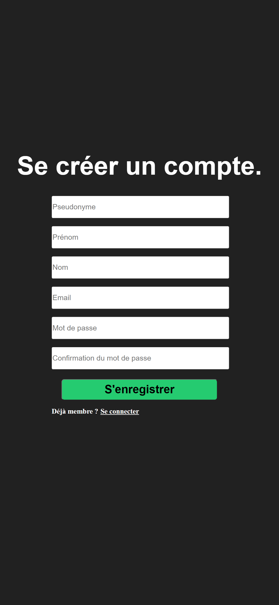
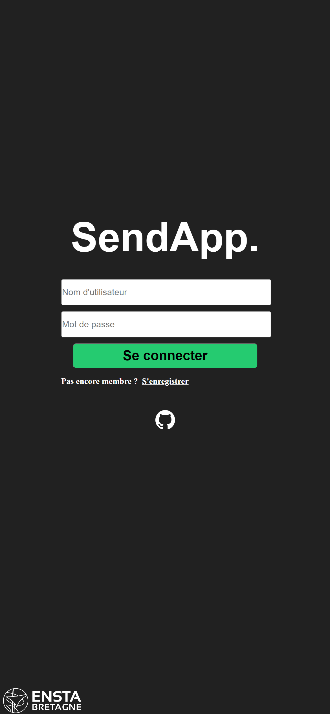
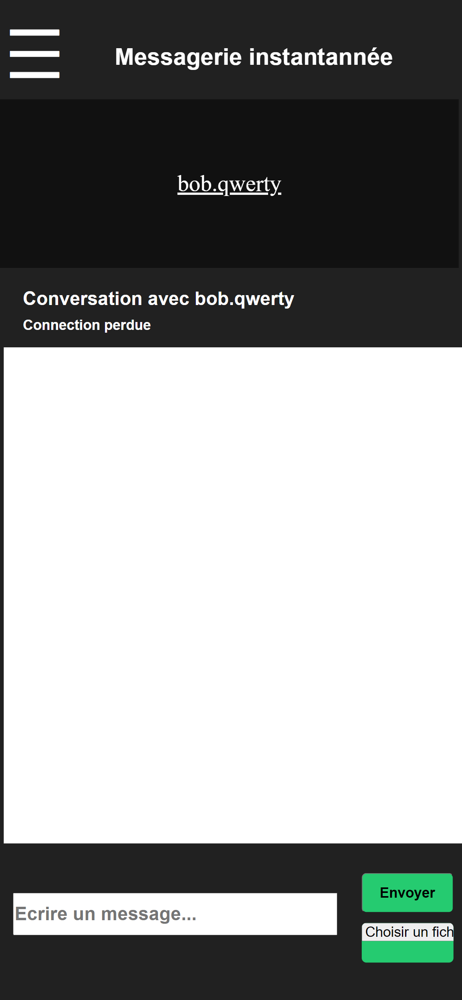

# Les solutions techniques - Le framework

## Recherche du framework adéquat

Un framework web est un ensemble de bibliothèques, de composants et de guidelines qui aident les développeurs à créer des applications web de manière plus efficace et plus rapide. Il fournit une structure de base pour le développement d'applications web en gérant certaines tâches communes telles que la gestion de la sécurité, l'authentification, les requêtes HTTP, la gestion de la base de données ...  
Un framework web peut également inclure des modèles pour les interfaces utilisateur et la mise en page, ce qui permet aux développeurs de se concentrer sur les fonctionnalités spécifiques de leur application sans avoir à constamment réinventer la roue pour les tâches courantes.  
L'utilisation d'un framework web peut améliorer la qualité du code, accélérer le développement et faciliter la maintenance et l'évolution de l'application au fil du temps.  

Comme cités dans la partie précédente, on en retrouve plusieurs tels que :
- [Ruby on Rails (RoR)](https://rubyonrails.org/)
- [Django](https://www.djangoproject.com/)
- [Express](https://expressjs.com/fr/)
- [Node.js](https://nodejs.org/en/)
- [Flask](https://flask.palletsprojects.com/en/2.2.x/)
- ...  

Parmi ces derniers, j'ai eu plusieurs expériences avec Flask, Node.js et une avec Django. Ils ont tous leurs avantages et inconvénients. Mon choix va se porter sur Django car j'avais été très satisfait lors de ma première expérience sur un projet minimaliste en entreprise. Ce projet me permet d'aller plus loin dans le fonctionnement de ce framework.  

Django est framework web haut niveau en python dont le développement a débuté en 2003. Ce framework est libre d'utilisation. Il permet de créer des serveurs web léger. Autour de Django s’est construit une communauté très active, avec au moins deux conférences par an (DjangoCon). La documentation est très bien détaillée. Une nouvelle version du framework sort tous les 8 mois environ.

<p align="center" width="100%">
      
</p>

Après plusieurs recherches sur internet et l'avis d'une connaissance, j'ai pu dresser des tableaux de ses avantages et inconvénients.

| Avantages | Commentaires | 
|-----------|--------------|
| Beaucoup de fonctionnalités built-in | Gestion des utilisateurs, de la base de données, l'interface d'administration |
| Protection contre les attaques par injection SQL et les attaques XSS | Interessant pour l'utilisation du Local Storage des navigateurs internet |
| Intégration facile avec d'autres technologies | Gestion des websockets pas exemple |
| Structure claire et organisée | S’articule complétement autour du pattern logiciel MVT (Model, Vue, Template). Cela permet de séparer le traitement des informations de l’affichage.  |

| Inconvénients | Commentaires | 
|-----------|--------------|
| Surdimensionné pour les petits projets | Django est utilisé par Facebook, Instagram ... |
| Lent si on ne respecte pas la structure de programmation | Il faut veiller à bien comprendre la méthodologie expliqué dans la documentation |
| Pas simple d'utilisation au départ | Nécéssite de lire la documentation |  

Je pense donc que Django est vraiment adapté pour ce type de projet.

## Mise en place du projet

### La structure

La structure de code à l’avantage d’être claire, les applications (fonctionnalités) utilisées par le serveur sont isolées dans leurs répertoires correspondants. C'est au developpeur d'imaginer la structure. Ci-dessous le répertoire du serveur [sendapp](https://github.com/MalloryLP/sendapp/tree/main/sendapp), dans lequel on retrouve les codes relatifs à la gestion des [comptes](https://github.com/MalloryLP/sendapp/tree/main/sendapp/accounts), aux [chats](https://github.com/MalloryLP/sendapp/tree/main/sendapp/chat), les [paramètres sur serveur](https://github.com/MalloryLP/sendapp/tree/main/sendapp/sendapp) et les répertoires liés au front-end, [static](https://github.com/MalloryLP/sendapp/tree/main/sendapp/static) et [template](https://github.com/MalloryLP/sendapp/tree/main/sendapp/templates). Le serveur est livré avec une base de données relationnelles sqlite3.


<p align="center" width="100%">
      
</p>

Si on regarde de plus près dans le répertoire lié à la gestion des [comptes](https://github.com/MalloryLP/sendapp/tree/main/sendapp/accounts), on retrouve plusieurs programmes :

<p align="center" width="100%">
     
</p> 

Dans un projet Django, chaque application a généralement ces fichiers. On retrouve la même structure de code dans le répertoire [chat](https://github.com/MalloryLP/sendapp/tree/main/sendapp/chat) :

- `models.py` : Y sont définies les classes de modèles Django qui représentent les tables de la base de données.
- `forms.py` : C'est le fichier où les formulaires sont définis, utilisés pour saisir et valider les données en vue de les enregistrer dans la base de données.
- `views.py` : C'est le fichier où les vues sont définies, qui sont les fonctions ou les classes qui gèrent les requêtes HTTP et renvoient les réponses HTTP. C'est la partie la plus importante.
- `urls.py` : Il gère les urls de l'application, associant les URL aux vues.
- `test.py` : On y retrouve les programmes pour des tests.
- `admin.py` : Utilisé pour faire le lien avec l'interface administrateur de Django.
- `apps.py` : Sert à modifier des paramètres liés à l'application.

J'ai voulu quelque chose de simple pour l'application avec une page d'accueil, de connexion, de création de compte et le chat. Le diagramme fonctionnel ci-dessous représente la structure du site :

<p align="center" width="100%">
    
</p>


L'utilisateur demande à accéder à la page principale. Il n'est pas connecté. S'offre à lui deux choix : se connecter ou s'enregistrer. Une fois qu'il aura complété le formulaire, il sera connecté et redirigé vers la page `/home`. Celle-ci propose plusieurs options comme : se déconnecter, aller dans les paramètres du compte utilisateur et accéder à la messagerie.  
En parallèle, l'administrateur du site peut demander la page `/admin` pour administer le site et sa base de données. Cette interface est implémenté directement à la création du serveur et peut être modifiée. 

### Les urls

La description des urls auquels l'utilisateur à accès sont disponibles dans les fichiers urls.py de chaque répertoire d'application correspondant. A ces urls sont associés des classes traités comme des vues. Ces classes gèrent les requettes HTTP GET et POST.

Description des urls gérés par l'application relative à la gestion des comptes :
```python
urlpatterns = [
    path('register/', views.Register.as_view(), name='register'),
    path('gen/', views.KeyGen.as_view(), name='gen'),
    path('api/', views.EncryptionKey.as_view(), name='api'),
    path('login/', views.Login.as_view(), name='login'),
    path('logout/', auth_views.LogoutView.as_view(), name='logout'),
]
```

Description des urls gérés par l'application chat :
```python
urlpatterns = [
    path('chat/', views.Home.as_view(), name='chat'),
    path('chat/<str:username>/', views.Chat.as_view(), name='friendchat')
]
```
Description des urls gérés par le serveur en lui même :
```python
urlpatterns = [
    path('admin/', admin.site.urls),
    path('home/', Home.as_view(), name='home'),
    path('params/', Params.as_view(), name='params'),
    path('', include('accounts.urls')),
    path('', include('chat.urls')),
]
```

Par exemple, on peut analyser les codes impliqués la création de compte d'un utilisateur. D'après le diagramme fonctionnel, il faut aller à la page `/register`.

```python
path('register/', views.Register.as_view(), name='register'),
```

La classe `Register` est traitée comme une vue. Django permet de nommer les urls liés aux classes pour pouvoir directement les appeler dans d'autre parties du code.

Ci-dessous la classe `Register` qui hérite de la classe `View`, avec les méthodes `get` et `post` qui ont étés surchargées.

```python
class Register(View):

    def get(self, request):
        form = CustomUserRegisterForm()

        return render(request, 'accounts/register.html', context={'form': form})

    def post(self, request):
        form = CustomUserRegisterForm(request.POST)

        if form.is_valid():
            new_user = form.save()
            new_user = authenticate(username=form.cleaned_data['username'],
                                    password=form.cleaned_data['password1'],
                                    )
            login(request, new_user)

            return redirect('gen')
```

Quand le navigateur fait la requête GET sur `/register`, la méthode `get` permet de retourner le formulaire d'inscription avec la méthode `render`, qui retourne la page HTML et le contexte. Le contexte est un dictionnaire pour passer informations au HTML tel que des variables ou des formulaires ici. Le formulaire d'inscription est aussi une classe, on verra son implémentation par la suite. Quand l'utilisateur veut envoyer des informations vers le serveur (données du formulaire), c'est la méthode `post` qui va être utilisé. On récupère les informations de la requêtes au travers de `request`, on traite les données et le navigateur est redirigé vers la page `gen` avec la méthode `redirect`. Le nom d'url `gen` est associé à la classe `KeyGen` comme vu plus haut.

### Le modèle de création du compte

Comme pour toutes messageries intantannées, il faut pouvoir créer son compte. Ci-dessous le formulaire d'inscription. Des informations basiques y sont demandés.

<p align="center" width="100%">
     
</p>

Le formulaire est basé sur la classe `CustomUserRegisterForm` qui hérite de la classe `UserCreationForm`. Là est la force de ce framework, le backend est lié au frontend par l'intermédiaire de classes, ce qui permet de developper des codes clairs et lisibles, sans ambiguités.

Le formulaire inclut six champs, chacun avec un libellé et un widget personnalisé qui ajoute des attributs de style à chaque champ. Les six champs sont `username`, `email`, `first_name`, `last_name`, `password1`, et `password2`. Le paramètre `attr` permet de definir les attributs de style à appliquer sur les champs.

Le formulaire utilise la méthode `save()` pour enregistrer l'utilisateur dans la base de données, en appelant la méthode `create_user()` de Django. La valeur de `commit` est définie par défaut sur True, ce qui signifie que l'utilisateur sera enregistré immédiatement en appelant la méthode `save()`.

```python
class CustomUserRegisterForm(UserCreationForm):  
    username = forms.CharField(label='Username', min_length=5, max_length=150, widget=forms.TextInput(attrs={   'class': "input-form", 'placeholder': 'Pseudonyme', 'style': "--top_level: 1vh;"}))  
    email = forms.EmailField(label='Email', widget=forms.TextInput(attrs={  'class': "input-form", 'placeholder': 'Email', 'style': "--top_level: 16vh;"}))
    first_name = forms.CharField(label='First name', widget=forms.TextInput(attrs={ 'class': "input-form", 'placeholder': 'Prénom', 'style': "--top_level: 6vh;"}))
    last_name = forms.CharField(label='Last name', widget=forms.TextInput(attrs={   'class': "input-form", 'placeholder': 'Nom', 'style': "--top_level: 11vh;"}))
    password1 = forms.CharField(label='Enter password', widget=forms.PasswordInput(attrs={  'class': "input-form", 'placeholder': 'Mot de passe', 'style': "--top_level: 21vh;"})) 
    password2 = forms.CharField(label='Confirm password', widget=forms.PasswordInput(attrs={'class': "input-form", 'placeholder': 'Confirmation du mot de passe', 'style': "--top_level: 26vh;"}))  
  
    def save(self, commit = True):  
        user = User.objects.create_user(  
            username = self.cleaned_data['username'],  
            email = self.cleaned_data['email'],  
            password = self.cleaned_data['password1'],
            first_name = self.cleaned_data['first_name'],
            last_name = self.cleaned_data['last_name']
        )  
        return user  
```

Une fois que la classe correspondant au modèle du formulaire d'inscription est crée, il n'y a plus qu'à l'instancier dans la vue `Register`. Quand un navigateur fait une requête GET, on comprend mieux le `form = CustomUserRegisterForm()` et le fait qu'il soit retourné par la méthode avec la page `accounts/register.html`. 

```python
class Register(View):

    def get(self, request):
        form = CustomUserRegisterForm()

        return render(request, 'accounts/register.html', context={'form': form})

    [...]

```

Le `render(request, 'accounts/register.html', context={'form': form})` retourne la page HTML suivante contenant le formulaire d'inscription. La balise `form` contient un attribut `action` qui pointe vers `register` avec la méthode POST. La balise `` est utilisée pour inclure un jeton CSRF (Cross-Site Request Forgery) pour protéger contre les attaques de falsification de requêtes. Le formulaire s'affiche au travers de la variable de template `form` passée par le `context` de GET.

```html
<body>
    <span class="registerlogo">Se créer un compte.</span>
    <div class="register-container">
        <form class="register-form" action="" method="post">
            
            <span>{{form.username}}</span>
            <span>{{form.first_name}}</span>
            <span>{{form.last_name}}</span>
            <span>{{form.email}}</span>
            <span>{{form.password1}}</span>
            <span>{{form.password2}}</span>
            <input type="submit" value="S'enregistrer" class="registerbtn">
            <span class="login">Déjà membre ?</span>
            <a class="loginbtn" href="">Se connecter</a>
        </form>
    </div>
</body>
```

Quand le bouton "S'enregistrer" est pressé, on se retrouve dans la méthode `post`. Même principe que pour une requête GET, on instancie la classe `CustomUserRegisterForm` avec pour variable de classe `request.POST` contenant les données renseignées par le nouvel utilisateur fraichement retournées. La méthode vérifie si les données sont valides, par exemple si l'email renseigné contient un @ ou non. Si les données sont correctes, elles sont directement enregistrées dans la base de données, et l'utilisateur est authentifié (et redirigé vers `/gen`, on verra pourquoi).

```python
    class Register(View):

    [...]

    def post(self, request):
        form = CustomUserRegisterForm(request.POST)

        if form.is_valid():
            new_user = form.save()
            new_user = authenticate(username=form.cleaned_data['username'],
                                    password=form.cleaned_data['password1'],
                                    )
            login(request, new_user)

            return redirect('gen')
```

### Le modèle de connection
Le principe de connexion au site est classique. Il s'agit d'un formulaire de connexion. Il contient les champs `username` et `password`, ainsi qu'un bouton pour se connecter.

<p align="center" width="100%">
     
</p>

Son fonctionnement est très simple, son implémentation est bien décrite dans la documentation de Django. Cela ce base sur la vue `Login`. Même principe, quand un navigateur fait une requête GET sur `/login`, si l'utilisateur est déjà authenifié, on redirige vers `/home`, sinon on retourne la page HTML `login.html` contenant le formulaire de connexion.
```python
class Login(View):

    def get(self, request):
        if request.user.is_authenticated:
            return redirect('home')
        else:
            return render(request, 'accounts/login.html')

    [...]
```

Ci-dessous le code HTML de la page `login.html` contenant le formulaire de connexion. On retrouve le token CSRF pour protéger l'utilisateur et le formulaire avec le bouton `Se connecter`. De la même manière, quand le bouton "S'enregistrer" est pressé, on se retrouve dans la méthode `post` coté serveur.

```html
<form class="login-form" action="" method="POST">
    
    <input class="username" type="text" placeholder="Nom d'utilisateur" name="username" />
    <input class="password" type="password" placeholder="Mot de passe" name="password" />
    <button class="loginbtn">Se connecter</button>
    <span class="register">Pas encore membre ?</span>
    <a class="registerbtn" href="">S'enregistrer</a>
</form>
```

La méthode `post` est appelée quand le bouton "Se connecter" est pressé. Elle vérifie si les données sont correctes, et si elles sont correctes, elle redirige vers `/home`, sinon elle retourne la page HTML `login.html` une nouvelle fois contenant le formulaire de connexion avec un message d'erreur.

```python
class Login(View):

    [...]

    def post(self, request):
        username = request.POST.get('username')
        password = request.POST.get('password')

        user = authenticate(request, username=username, password=password)

        if user:
            if user.is_active:
                login(request, user)
                return redirect('home')
        else:
            return render(request, 'accounts/login.html', context={"login_error" : "Nom d'utilisateur ou mot de passe incorrect."})
```

### Le modèle de chat

Avec Django, on peut en plus d'enregistrer les utilisateurs, créer des modèles. Définis, chaque instanciation du modèle sera enregistré dans la base de données. Ainsi, je souhaite que les messages soient enregistrés dans la base de données. Je crée un modèle `ChatModel` qui sera utilisé pour enregistrer les messages.

Une instance de "Chat" est caractérisée par celui qui envoie le message (`sender`), le contenu du message (`message`), le nom du thread (`thread_name`), et la date de création du message (`timestamp`). `threan_name` est un nom unique pour chaque conversations, on verra comment il est construit dans quelques lignes.

```python
class ChatModel(models.Model):
    sender = models.CharField(max_length=100, default=None)
    message = models.TextField(null=True, blank=True)
    thread_name = models.CharField(null=True, blank=True, max_length=50)
    timestamp = models.DateTimeField(auto_now_add=True)

    def __str__(self):
        return self.message
```

Ci-dessous la page permettant d'envoyer des messages à ses amis :
<p align="center" width="100%">
     
</p>

L'affichage et la récupération des messages dans la base de données se passe dans la classe `Chat`. Quand on clique sur le nom d'un amis pour discutter, on passe par cet URL : `chat/<str:username>/`. Dans la photo ci-dessus, pour discutter avec Bob, la requête se fait vers `chat/bob.qwerty/`, bob.qwerty est alors contenu dans la variable `username`. La méthode `get` est chargée de récupérer les messages d'un thread spécifique et de les afficher dans le chat courant.`thread_name` est une variable utilisée dans la méthode `get()` de la classe `Chat` pour identifier le nom du fil de discussion entre deux utilisateurs. Le nom du fil de discussion est une chaîne qui identifie de manière unique un fil de discussion entre deux utilisateurs. Le nom du fil de discussion est généré en concaténant les ID de l'utilisateur authentifié et de l'utilisateur ami dans l'ordre croissant, séparés par un `-`. Les ID sont attribués par Django pour chaque utilisateur. Cela permet de garantir que le même nom de fil de discussion est utilisé, quel que soit l'ordre dans lequel les ID des utilisateurs sont fournis, et donc que les messages des deux utilisateurs sont regroupés dans le même fil de discussion.

Par exemple, si l'utilisateur authentifié a un ID de 1 et l'utilisateur ami un ID de 2, le nom du fil de discussion sera "chat_1-2". Si les identifiants étaient inversés, le nom du fil de discussion serait toujours "chat_1-2". 

On remarque qu'il n'y a pas de methode `post`. Les messages ne passent pas directement par le serveur Django.


```python
class Chat(View):

    def get(self, request, username):
        user_id = request.user.id
        friend_id = User.objects.get(username=username).id

        if user_id > friend_id:
            thread_name = f'chat_{user_id}-{friend_id}'
        else:
            thread_name = f'chat_{friend_id}-{user_id}'

        message_objs = ChatModel.objects.filter(thread_name=thread_name)

        senders = {}
        send_messg = []
        for i, mesg in enumerate(message_objs):
            user_obj_temp = User.objects.get(id=mesg.sender)
            senders[user_obj_temp.id] = f"{user_obj_temp.username}"
            send_messg.append([f"{senders[user_obj_temp.id]}", f"{mesg.message}"])        
            #send_messg.append([f"{mesg.sender}", f"{mesg.message}", mesg.timestamp])

        users = User.objects.exclude(username=request.user.username)
        return render(request, 'chat/chat.html', context={'requested_user_id' : f"{friend_id}" ,'users': users, 'messages' : send_messg, 'friend' : username, 'count' : len(send_messg)})

    def post(self, request):
        pass
```