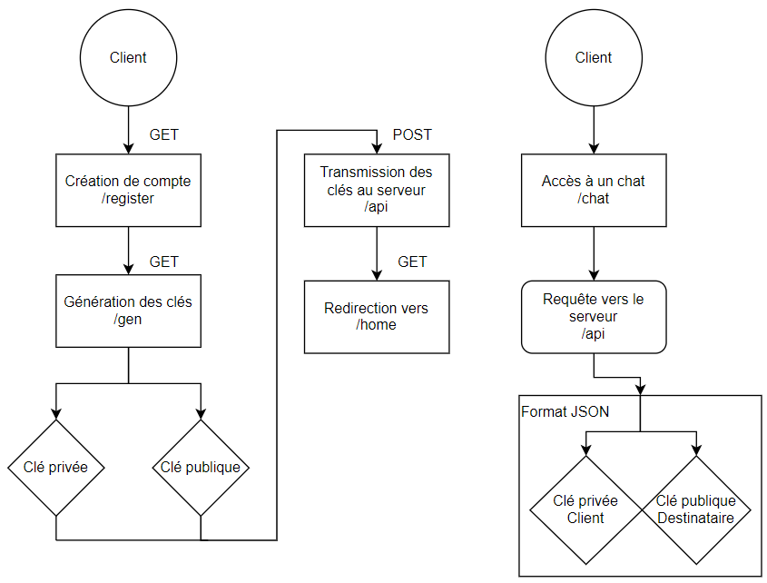

# Les solutions techniques - Le chiffrement

La sécurité des données est un enjeu crucial pour toute application qui traite des informations sensibles, notamment les messageries instantanées. Pour garantir la confidentialité des échanges, il est souvent recommandé de mettre en place un chiffrement de bout en bout.

## Quel chiffrement appliquer ?

Un algorithme de chiffrement est une méthode mathématique utilisée pour transformer un texte clair en un texte chiffré, afin de garantir la confidentialité et la sécurité des données lorsqu'elles sont transmises ou stockées.

Il existe deux types d'algorithmes de chiffrement : 
- symétrique
- asymétrique

Les algorithmes de chiffrement symétrique, tels que l'Advanced Encryption Standard (AES), utilisent une même clé pour chiffrer et déchiffrer les données. Les algorithmes de chiffrement asymétrique, tels que le Rivest-Shamir-Adleman (RSA), utilisent deux clés distinctes : 
- une clé publique pour chiffrer les données
- une clé privée pour les déchiffrer

L'AES est un algorithme de chiffrement symétrique qui est généralement utilisé pour chiffrer les données. L'avantage principal de l'AES est sa vitesse de traitement élevée, qui permet de chiffrer rapidement de grandes quantités de données. En outre, l'AES est considéré comme sûr et fiable, car il a été largement étudié et testé par la communauté de la sécurité informatique.

L'avantage principal du RSA est sa sécurité, car il est basé sur la difficulté de factoriser de grands nombres premiers (clés robustes). Le RSA est également largement utilisé dans les systèmes de signature numérique, où il est utilisé pour garantir l'authenticité et l'intégrité des données.

En rédigant ce rapport, j'ai appris que dans plusieurs cas d'applications, on peut utiliser un chiffrement hybride, qui combine les avantages de l'AES et du RSA. Dans un chiffrement hybride, les données sont d'abord chiffrées avec une clé AES unique pour chaque message, puis la clé AES est elle-même chiffrée avec la clé publique RSA du destinataire avant d'être envoyée. Le destinataire peut ensuite utiliser sa clé privée pour déchiffrer la clé AES, puis utiliser cette clé pour déchiffrer le message.

Avec toutes ces informations, j'ai décidé d'implémenter un algorithme de type RSA à deux clés pour cette messagerie. Dans une premier temps, je voulais montrer qu'il était possible d'implémenter un tel algorithme pour cette messagerie et mettre l'aspect sécurité de coté (en début de projet) en suivant ce schéma :

      

Cette implémentation n'est pas du tout sécurisé et présente plusieurs failles comme le fait que la clé privée doit être connue que par son propriétaire (même le serveur soit l'ignorer). Le fait de la transmettre du serveur au propriétaire via une requête HTTP fait que le chiffrement est vulnérable. J'explique quelles solutions pourraient être mises en oeuvre pour contrer ces problèmes dans la partie [04_les_ameliorations](https://github.com/MalloryLP/sendapp/tree/main/doc/04_les_ameliorations.md).

## Mise en place du chiffrement

### Génération des clés de chiffrement

### Chiffrement des messages