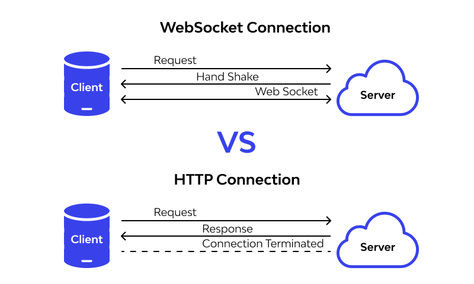
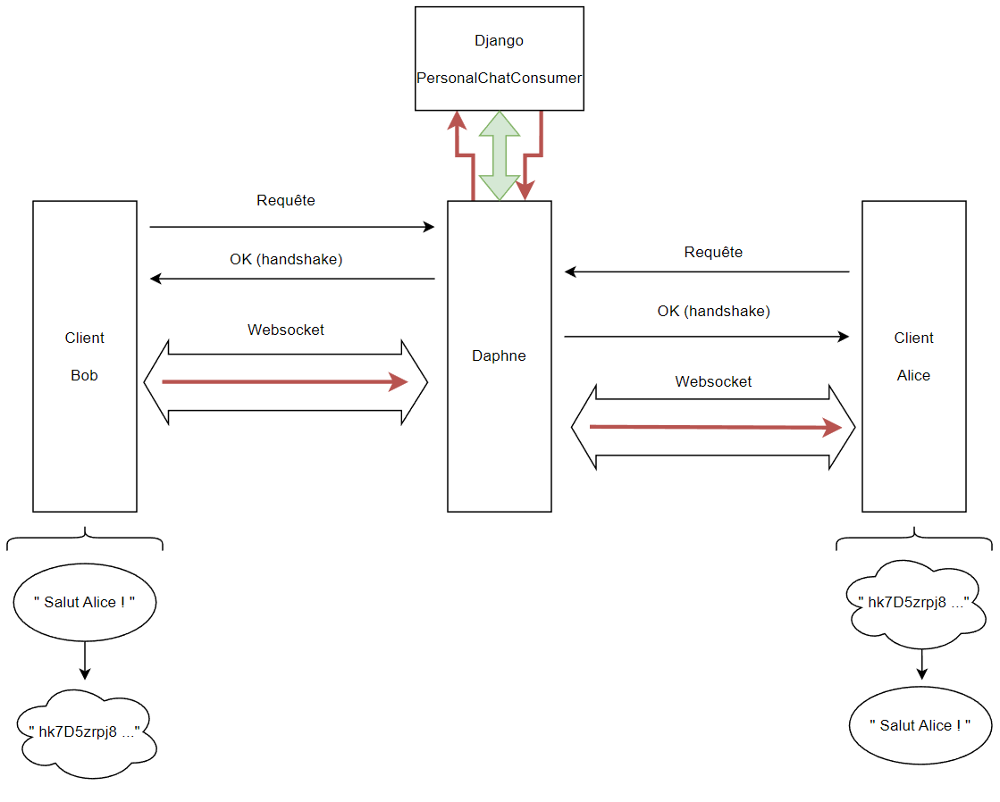

# Les solutions techniques - Les websockets

Maintenant que nous sommes capables de générer des clés de chiffrement, chiffrer et déchiffrer des messages, il s'agirait de pouvoir les transmette au destinataire !

On voit directement le problème qui va arriver : comment faire en sorte que quand les utilisateurs sont en train de s'envoyer des messages, ceux-ci s'affichent en temps réel ?

Deux solutions :
- Actualiser la page `/chat` à intervalle de temps constant
- Utiliser les websockets

La première solution me paraît trop simple et pas très élégante. Tandis que la seconde est beaucoup plus intéressante techniquement. J'ai donc décidé de mettre en place le protocole websocket dans ce projet.

## Qu'est-ce que ce protocole ?

Le protocole WebSocket est un protocole de communication réseau bi-directionnel, conçu pour permettre une communication en temps réel entre un client (comme un navigateur web) et un serveur via une connexion TCP unique.

Il permet aux applications web de communiquer de manière plus efficace et en temps réel avec le serveur en évitant les limites du protocole HTTP, qui est principalement conçu pour une communication client-serveur unidirectionnelle.

En utilisant WebSocket, les applications web peuvent établir une connexion permanente avec le serveur et envoyer et recevoir des données en temps réel sans avoir besoin de rafraîchir la page ou de renvoyer la demande à chaque fois. Cela permet une communication bidirectionnelle en temps réel, ce qui est utile pour des applications telles que les jeux en ligne, les salles de chat, la surveillance de l'état en temps réel...

<p align="center" width="100%">
      
</p>

## Mise en place du protocole

### Définitions

Dans un environnement non sécurisé, Django peut prendre en charge la gestion des websockets. La méthode de développement est décrite dans la documentation dans notre cas, elle doit être adaptée.

Dans le fichier de configuration `settings.py`, il faut ajouter :

```python
ASGI_APPLICATION = 'sendapp.asgi.application'

# LEARN CHANNELS
CHANNEL_LAYERS = {
    "default": {
        "BACKEND": "channels.layers.InMemoryChannelLayer"
    },
}
```

Ce code est lié à la configuration de Django Channels, qui est un paquetage tiers qui étend Django pour prendre en charge les WebSockets et autres protocoles asynchrones. Plus précisément, le code définit les couches d'application et de canal ASGI à utiliser par Django Channels.

ASGI (Asynchronous Server Gateway Interface) est une spécification d'interface pour les serveurs Web qui permettent une gestion asynchrone des demandes HTTP/HTTPS et des connexions WebSocket. ASGI fournit une interface unifiée pour gérer à la fois les connexions HTTP/HTTPS et WebSocket, ainsi que d'autres protocoles asynchrones.

Le paramètre `ASGI_APPLICATION` spécifie l'application ASGI à utiliser. Cela signifie que les canaux Django utiliseront l'attribut application du module sendapp.asgi comme point d'entrée pour le traitement des demandes ASGI.

Le paramètre `CHANNEL_LAYERS` spécifie les couches à utiliser pour gérer les connexions WebSocket. Dans le code donné, une seule couche est définie, qui est une couche de canal en mémoire avec le backend channels.layers.InMemoryChannelLayer. Cela signifie que Django Channels une couche en mémoire pour gérer les connexions WebSocket.

Maintenant, il faut définir un point d'accès pour maintenir la connexion entre le client et le serveur (principe du websocket). Ce point d'accès est défini dans le fichier `rooting.py` (fichier à créer) :

```python
from chat.consumers import PersonalChatConsumer

ws_urlpatterns = {
    path('ws/<int:id>/', PersonalChatConsumer.as_asgi())
}
```

Toutes les requêtes qui pointeront vers `wss/<int:id>/` seront envoyées à la couche `PersonalChatConsumer` (une sorte de vue) qui est définie dans le fichier `consumers.py`. Le `<int:id>` correspond à l'id de l'amis auquel on veut envoyer un mesage.

### Problème !

La partie précédente correspond à ce qui est décrit dans la documentation Django. Or, les requêtes sont en HTTPS, donc chiffrées. Pour établir la liaison entre un client et le serveur, plusieurs trames sont envoyées en début de communication pour définir le protocole. Django ne peut donc pas savoir qu'il s'agit du protocole websocket car il ne pourra pas les interpréter...

Après pas mal de recherches, j'ai découvert [Daphne](https://github.com/django/daphne). C'est un serveur ASGI qui permet de gérer les connexions WebSocket, HTTP/HTTPS et d'autres protocoles asynchrones pour les applications Python. Il est conçu pour fonctionner avec Django et d'autres frameworks. Daphne est utilisé par Django Channels comme serveur pour gérer les connexions. Pour faire simple, toutes les requêtes relatives aux websockets passeront par le serveur Daphne. 

Pour l'installer :

```shell
pip install daphne
```

Pour lancer le serveur Daphne :

```shell
daphne -e ssl:8001:privateKey=./sendapp/code.pem:certKey=./sendapp/certif.pem sendapp.asgi:application
```

on remarque les références au certificat SSL et à `ASGI_APPLICATION` dans la ligne de commande.

### Fonctionnement

Voici une visualisation du parcours du message au travers des différents acteurs (flèche rouge) :

<p align="center" width="100%">
      
</p>

Tout commence par les clients, c'est à deux d'initier la connexion websocket. Cela passe à la page `/chat`, la première chose à faire est de créer un objet WebSocket disponible grâce à l'API Javascript. Il permet de créer une connexion vers le serveur à l'adresse décrite plus haut.

```javascript
// ws : websocket
// wss : secure websocket
const socket = new WebSocket(
    'wss://'
    + localip
    + ':8001'
    + '/ws/'
    + friend_id
    + '/'
);
```

On sait que toutes les requêtes qui pointent vers cette adresse sont traitées par la vue `PersonalChatConsumer`. Les deux premières classes de cette méthode servent à gérer les connexions et les fins de discussions. A la connexion, la méthode `connect` va créer un groupe dans lequel seront les deux personnes qui veulent communiquer. Cela est réalisable, car l'id de l'ami est contenu dans l'url de la requête et l'id de l'utilisateur est contenu dans le corps de la requête. Mettre les deux personnes dans le même groupe permet de faciliter le traitement des requêtes de sorte à ce que si l'un envoie un message, il sera forcément destiné à son ami (qui fait donc parti du groupe). La méthode `disconnect` supprime l'utilisateur qui a quitté la page du groupe. Cela permet que celui-ci puisse être ajouté à un nouveau groupe.

```python
class PersonalChatConsumer(AsyncWebsocketConsumer):
    async def connect(self):

        user_id = self.scope['user'].id
        friend_id = self.scope['url_route']['kwargs']['id']
        
        if int(user_id) > int(friend_id):
            self.room_name = f'{user_id}-{friend_id}'
        else:
            self.room_name = f'{friend_id}-{user_id}'
        
        self.room_group_name = 'chat_%s' % self.room_name

        await self.channel_layer.group_add(
            self.room_group_name,
            self.channel_name
        )
        
        await self.accept()

    async def disconnect(self, code):
        self.channel_layer.group_discard(
            self.room_group_name,
            self.channel_name
        )

    [...]
```

Maintenant que les connexions et les fins de discussions sont gérées au niveau du backend, on peut spécifier au client le status de la connexion au serveur avec les events listener `socket.onopen`, `socket.onclose` ou encore `socket.onerror`. 

```javascript
socket.onopen = function(e){
    console.log("CONNECTION ESTABLISHED");
    document.querySelector('#connection_status').innerHTML = `Connection établie`;
}

socket.onclose = function(e){
    console.log("CONNECTION LOST");
    document.querySelector('#connection_status').innerHTML = `Connection perdue`;
}

socket.onerror = function(e){
    console.log("ERROR OCCURED");
    document.querySelector('#connection_status').innerHTML = `Une erreur est survenue`;
}
```

L'envoie de message se fait avec la méthode `send`, et la réception de message se fait à l'événement `socket.onmessage`.

```javascript
//Envoyer un message
socket.send(

    [...]

);

//Reception d'un message
socket.onmessage = function(e){

    [...]

};
```

Pour envoyer un message avec le protocole Websocket depuis le client, c'est très simple, il faut donner à la méthode `send` un objet JSON contenant le message à envoyer. Je précise aussi le type de message que je souhaite envoyer, par exemple `text` ou `image`.

```javascript
socket.send(JSON.stringify({
    'type': 'text',
    'message': new Uint8Array(ciphertext).toString(),
    'username' : username
}));
```

La méthode de réception de message en encore plus simple, à chaque message reçu par le client, un événement est levé par `socket.onmessage`. Sera exécuté le code associé à cet événement (ici, le déchiffrement analysé dans [02_02_solutions_techniques_chiffrement](https://github.com/MalloryLP/sendapp/doc/02_03_solutions_techniques_chiffrement.md)).

```javascript
socket.onmessage = function(e){
    const data = JSON.parse(e.data);
    if(data.username != username){

        const values = data.message.split(",");
        const numbers = values.map(value => parseInt(value, 10));
        const message = Uint8Array.from(numbers);

        if(data.type == "text"){
            crypto.subtle.decrypt(
                {
                    name: "RSA-OAEP",
                },
                userprivateKey,
                message
            ).then(function(message){
                const uncrypted_message = arrayBufferToText(message)
                document.querySelector('#chat-body').innerHTML += `<div class="message" style="background-color: #b6b6b6;margin:10px;">${data.username} : ${uncrypted_message}<\div>`;
            })
        }else{

            //Réception des images !

            [...]

        }  
    }
}
```

Il ne reste plus qu'à voir comment les messages sont traités par le backend. A chaque envoi de message par `socket.send(json)`, le message (json) est reçu par la méthode `receive`. `data` est décomposé pour récupérer le type de message (texte ou image), le message chiffré et le nom de l'utilisateur qui a envoyé le message.  
Si le message est un texte, on le sauvegarde dans la base de données, puis il est transmis à tous les membres du groupe via la méthode `chat_message`. Si le message est une image, on l'envoie à tous les membres du groupe directement via la méthode `chat_image`. Dans ces deux méthodes, on utilise la méthode `send()`, qui va déclencher un événement `socket.onmessage` pour chaque message reçu chez le client.

```python
class PersonalChatConsumer(AsyncWebsocketConsumer):

    [...]

    async def receive(self, text_data=None, bytes_data=None):
        print("Daphne - message received")
        data = json.loads(text_data)

        type = data['type']
        message = data['message']
        username = data['username']

        if type == "text":
            await self.save_message(username, self.room_group_name, message)
            await self.channel_layer.group_send(
                self.room_group_name,
                {
                    'type': 'chat_message',
                    'message': message,
                    'username': username,
                }
            )
        elif type == "image":
            await self.channel_layer.group_send(
                self.room_group_name,
                {
                    'type': 'chat_image',
                    'message': message,
                    'username': username,
                }
            )

    async def chat_message(self, event):
        message = event['message']
        username = event['username']

        print("Daphne - " + username + " - message send using chat_message")

        await self.send(text_data=json.dumps({
            'type': 'text',
            'message': message,
            'username': username
        }))

    async def chat_image(self, event):
        message = event['message']
        username = event['username']

        print("Daphne - " + username + " - message send using chat_image")

        await self.send(text_data=json.dumps({
            'type': 'image',
            'message': message,
            'username': username
        }))

    @database_sync_to_async
    def save_message(self, username, thread_name, message):
        user_id = self.scope['user'].id
        ChatModel.objects.create(sender=user_id, message=message, thread_name=thread_name)
```