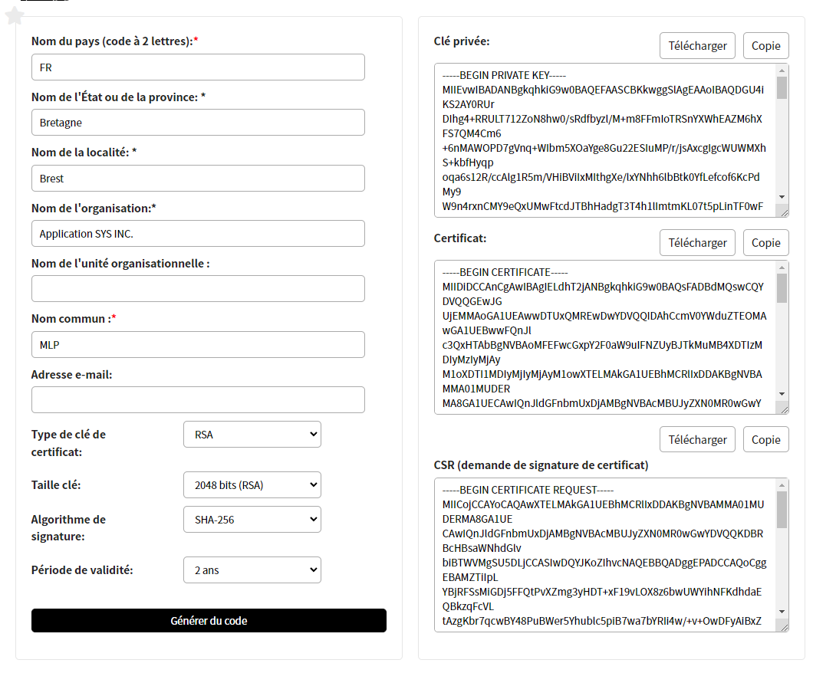

# Solutions techniques - Quelques informations supplémentaires

## Génération du certificat SSL

Un certificat SSL (Secure Sockets Layer) est un certificat numérique qui est utilisé pour sécuriser les connexions entre un serveur et un client. Il permet de chiffrer les données échangées entre les deux parties (même si nos messages transmis sont déjà chiffrés), empêchant ainsi toute interception ou modification non autorisée. Sans ce certificat, il est impossible de mettre une place le protocole HTTPS. Il faut donc pouvoir en générer un.

Les certificats SSL sont délivrés par des autorités de certification (CA - Certificate Authorities), qui sont des organisations qui vérifient l'identité et l'authenticité des propriétaires de sites web.

Il existe de nombreuses autorités de certification reconnues à l'échelle mondiale, telles que Comodo, Symantec, DigiCert, GlobalSign, Let's Encrypt... Les navigateurs web tels que Chrome, Firefox, Safari, Edge... ont des listes pré-installées de CA de confiance. Lorsqu'un propriétaire de site web souhaite obtenir un certificat SSL pour son site, il doit fournir des informations d'identification à l'autorité de certification, telles que son nom de domaine, son adresse postale, son adresse e-mail et des informations d'entreprise. L'autorité de certification vérifie ensuite ces informations avant d'émettre le certificat SSL.

Dans notre cas, le site ne sera pas déployé et restera en réseau local. Un vrai "faux" certificat SSL pourra satisfaire le besoin. Il faut trouver un service qui va nous donner un vrai certificat SSL mais qui ne sera pas validé par les autorités compétentes.

J'ai utilisé le site [Rakko Tools](https://fr.rakko.tools/tools/46/) pour cela :

<p align="center" width="100%">
      
</p>

En 5 lignes et un clic, j'ai pu obtenir un certificat avec les clés au format PEM. La clé privée est enregistrée dans le fichier `code.pem` et le certificat dans `certif.pem`. Au lancement du serveur Django, il faut simplement spécifier le chemin vers ces fichiers : 

```shell
python ./manage.py runsslserver --certificate ./sendapp/certif.pem --key ./sendapp/code.pem 0.0.0.0:8000
```

Le certificat n'étant pas reconnu par le navigateur, à chaque connexions au site, on va avoir un message d'avertissement disant qu'il n'est pas sécurisé sur le navigateur. Pas d'inquiétude, poursuivez.

On peut maintenant utiliser la librairie `crypto.subtle`.

## Transmission des images

Vous pourrez remarquer que la messagerie permet l'envoie d'images, cependant, cela n'est pas chiffré pour le moment. Quand l'utilisateur clique sur le bouton pour charger une image, cette dernière est sérialisée dans un tableau de d'entiers 8 bits. Ce tableau est transmit directement par le protocole websocket au destinataire.

```javascript
image_input.addEventListener("change", function(){
    if(image_input.files.length > 0){
        var file = image_input.files[0];
        var reader = new FileReader();
        reader.readAsArrayBuffer(file);
        reader.onload = function() {
            var data = new Uint8Array(reader.result);      

            /*crypto.subtle.encrypt(
                {
                    name: 'RSA-OAEP',
                },
                publicKey,
                data
            ).then(function(ciphertext){
                var image = new Uint8Array(ciphertext)
                console.log(image)
            })*/

            socket.send(JSON.stringify({
                'type': 'image',
                'message': new Uint8Array(reader.result).toString(),
                'username' : username
            }));

            var blob = new Blob([data], {type: "image/jpeg"});
            var imageURL = URL.createObjectURL(blob);
            var image_output = document.createElement("img");
            image_output.src = imageURL;

            document.querySelector('#chat-body').innerHTML += `<div class="message" style="background-color: #838383;margin:10px;">${username} : <\div>`;
            document.getElementById("chat-body").appendChild(image_output);

            image_input.value = '';

        }                    
    }
})
```

J'ai essayé de mettre en place un système de chiffrement mais il n'a pas fonctionné du fait que `crypto.subtle.encrypt` est asynchrone. La première idée était de découper l'array contenant les données en blocs à chiffrer et à transmettre. Il se trouve que les paquets n'arrivaient pas dans le bon ordre (asynchrone). Pour contrer cela, les paquets étaient numérotés et le client n'avait plus qu'à reconstruire dans l'ordre l'array à la réception. Il se trouve qu'à certains moments, la numérotation était erronée pour une majorité de paquets en fin de transmission et le déchiffrement ne se passait pas comme prévu. La méthode n'est pas adaptée. J'ai décidé de laisser cette fonctionnalité non chiffrée pour le moment.

Le code correspondant à la réception de l'array non chiffré est le suivant :

```javascript
socket.onmessage = function(e){

    [...]
    
    if(data.type == "text"){
        crypto.subtle.decrypt(
            {
                name: "RSA-OAEP",
            },
            userprivateKey,
            message
        ).then(function(message){
            const uncrypted_message = arrayBufferToText(message)
            //document.querySelector('#user-body').innerHTML += `${username} :`;
            document.querySelector('#chat-body').innerHTML += `<div class="message" style="background-color: #b6b6b6;margin:10px;">${data.username} : ${uncrypted_message}<\div>`;
        })
    }else{

        var blob = new Blob([message], {type: "image/jpeg"});
        var imageURL = URL.createObjectURL(blob);
        var image_output = document.createElement("img");
        image_output.src = imageURL;

        document.querySelector('#chat-body').innerHTML += `<div class="message" style="background-color: #838383;margin:10px;">${data.username} : <\div>`;
        document.getElementById("chat-body").appendChild(image_output);
    }
}
```

Si le message n'est pas du texte, alors c'est une image. L'instanciation d'un objet `Blob` permet de reconstruire une image à partir d'un array.

Avec toutes ces informations, vous êtes maintenant en mesure de comprendre tous les mécanismes qui ont été mis en place tant sur le backend avec Django et Daphne qu'au niveau du frontend pour la transmission de messages chiffrés !