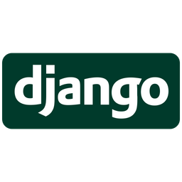

> [Mallory Lehuault-Parc](https://github.com/MalloryLP) - FIPA SE 2023

# Introduction

SendApp est un application de messagerie instantannée qui permet d'entretenir des conversations chiffrées de bout en bout entre tous les utilisateurs.  

Le projet se base sur [Django](https://www.djangoproject.com/) qui est un framework web open source en Python. L'application utlise le protocole Websocket, le serveur fonctionne de paire avec [Daphne](https://github.com/django/daphne) qui est un serveur de protocoles WebSocket.



Vous pourrez retrouver dans le répertoire [doc](https://github.com/MalloryLP/sendapp/tree/main/doc) toutes les informations et les recherches liées à ce projet. Dans le répertoire [sendapp](https://github.com/MalloryLP/sendapp/tree/main/sendapp) se trouve les codes le faisant fonctionner. 

# Installation

Copie des fichiers sources depuis Github :
```
git clone https://github.com/MalloryLP/sendapp.git
```

Le projet fonctionne avec Python et dépend de ces paquets :
- django
- channels
- django-sslserver

Mise en place de l'environnement sur Windows:

```powershell
python -m venv .venv
. .venv/Scripts/activate.ps1
pip install -r requirements.txt
```

# Lancement

Sur windows dans deux shells distincs :
```powershell
cd sendapp
python ./manage.py runsslserver --certificate ./sendapp/certif.pem --key ./sendapp/code.pem 0.0.0.0:8000
```

```powershell
cd sendapp
$env:DJANGO_SETTINGS_MODULE = 'sendapp.settings'
daphne -e ssl:8001:privateKey=./sendapp/code.pem:certKey=./sendapp/certif.pem sendapp.asgi:application
```
